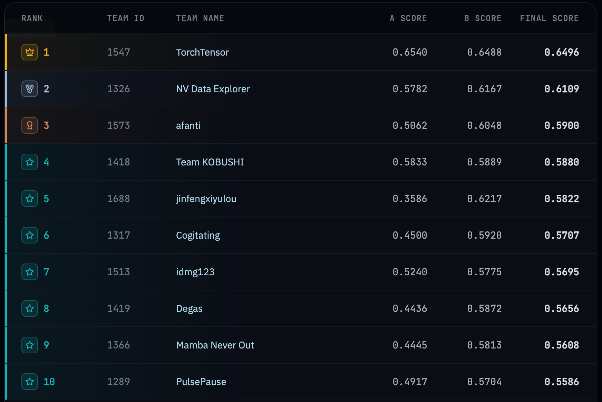

# KDD Cup 2026 DataAgents - Top1 🏆方案

比赛官网:
- https://dataagent.top/
- https://kdd2026.kdd.org/

相关技术分享: [小红书笔记合计](https://www.xiaohongshu.com/collection/item/6a5e1c8411f5000000000001?xhsshare=&appuid=60c4e14d000000000100a62f&apptime=1785636865&share_id=fb787ed3d8c7471fbff4b92a1e86d67e&share_channel=copy_link)



## 启动方式
### 1. 本地运行（uv）

#### 1.1 安装依赖

```bash
uv sync

# 准备本地 ASR 模型
bash src/data_agent_baseline/asr/prepare_models.sh
```

#### 2.2 执行任务

```bash
export DEFAULT_MODEL_API_URL="http://your-host:port/v1"
export DEFAULT_MODEL_API_KEY="your-key"
export DEFAULT_MODEL_NAME="your-model"

export INPUT_DIR="/path/to/input"
export OUTPUT_DIR="/path/to/output"
export TEMP_DIR="/path/to/temp"   # 临时/日志目录（可选，为空则用 /tmp/temp_<时间戳>）

# 启动 agent
uv run python src/data_agent_baseline/zz_agent_v2.py
```

#### 2.3 可运行示例脚本
```bash
export DEFAULT_MODEL_API_URL="http://10.166.17.60:8417/v1"
export DEFAULT_MODEL_API_KEY="empty"
export DEFAULT_MODEL_NAME="qwen3.5-35b-a3b"

export INPUT_DIR="~/Documents/work/20260400-data-agent/phase2/input"
export OUTPUT_DIR="~/Documents/work/20260400-data-agent/phase2/output_$(date +%Y%m%d_%H%M%S)"

uv run python src/data_agent_baseline/zz_agent_v2.py
```

### 3. Docker 运行

> **运行前请先修改脚本里的具体设置**：
> - `build.sh`：镜像名 `IMAGE_NAME`、tag `TAG`、目标平台（`--platform`）。
> - `docker_run_all.sh`：默认镜像 tag `DEFAULT_IMAGE_TAG`、运行目录 `BASE_DIR`、
>   `input` 挂载路径，以及模型环境变量 `MODEL_API_URL` / `MODEL_API_KEY` / `MODEL_NAME`。
>
> 按自己的路径、模型地址和镜像 tag 改好后再执行下面的命令。

```bash
# 构建镜像（arm64 本地用 + amd64 分发用，输出到 ./dist）
bash build.sh

# 运行（挂载 input/output/temp/logs，并注入模型环境变量）
bash docker_run_all.sh [image-tag] [run-id]
# 例: bash docker_run_all.sh final
```

